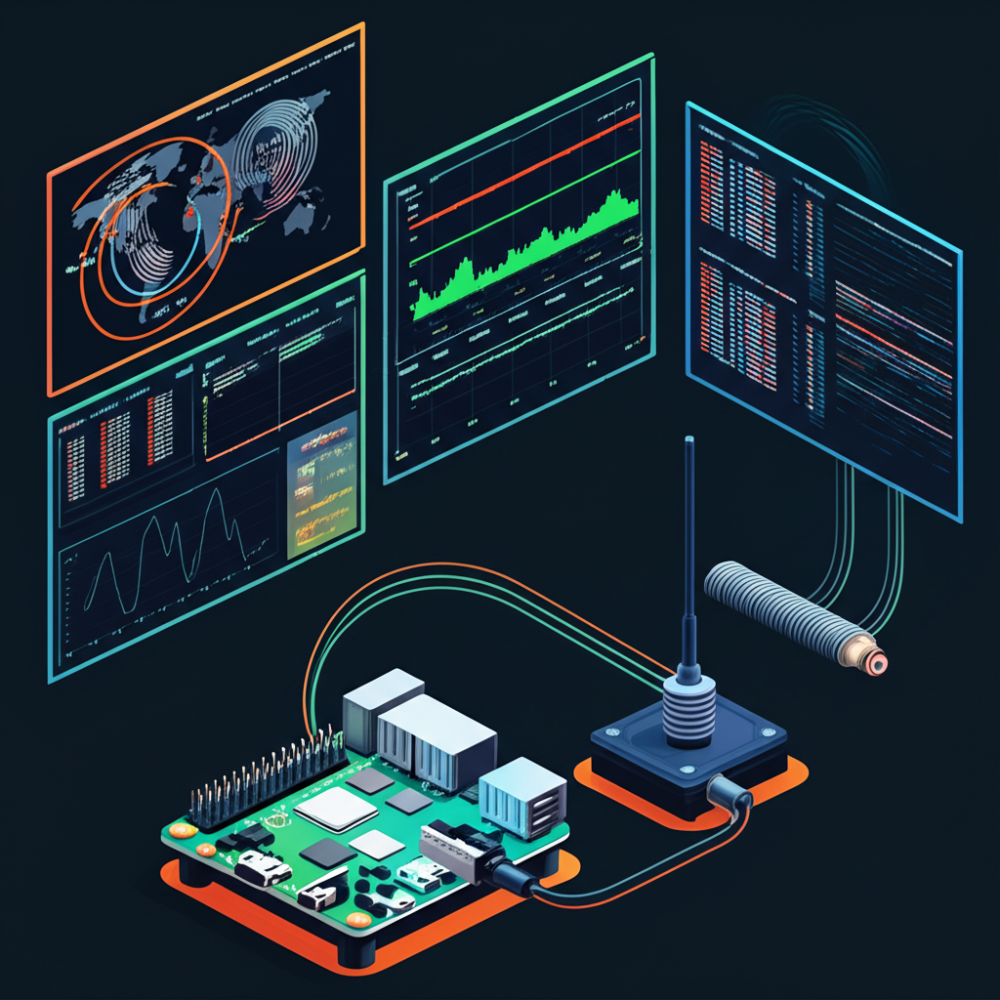

# RadioGPS Setup Documentation



Complete setup documentation for recreating the RadioGPS Raspberry Pi system from a clean Raspbian image.

## System Overview

This is a Raspberry Pi-based GPS time server and ADS-B receiver system with the following capabilities:

- **GPS Time Server**: High-precision NTP server using GPS PPS (Pulse Per Second)
- **ADS-B Receiver**: Aircraft tracking using RTL-SDR dongle
- **Temperature Monitoring**: System temperature logging with web interface
- **Web Management**: Cockpit-based web interface
- **SD Card Optimization**: Log2Ram and other optimizations to reduce SD card wear

## Hardware Requirements

### Main Components
- **Raspberry Pi 4 Model B** (4GB RAM recommended)
- **MicroSD Card** (32GB minimum, Class 10 or better)
- **GPS Module**: u-blox NEO-8M or compatible with PPS output
- **RTL-SDR Dongle**: RTL2832U-based SDR for ADS-B reception
- **Antenna**: GPS antenna and ADS-B antenna

### Hardware Connections
See [HARDWARE.md](HARDWARE.md) for detailed connection diagrams and pinouts.

## Software Stack

- **Base OS**: Raspberry Pi OS (Debian 12 Bookworm) 64-bit
- **GPS**: `gpsd` with PPS support
- **NTP**: `chrony` for time synchronization
- **ADS-B**: `readsb` for ADS-B decoding
- **Web Interface**: `cockpit` with custom temperature monitoring plugin
- **Logging**: `log2ram` for SD card wear reduction

## Quick Setup

### Repository Clone
This repository uses git submodules for the Cockpit plugins:
```bash
git clone https://github.com/brunoamui/radiogps-setup.git
cd radiogps-setup
git submodule update --init --recursive
```

### System Setup Steps
1. **Hardware Setup**: Follow [HARDWARE.md](HARDWARE.md)
2. **Base System**: Follow [01-BASE-SYSTEM.md](docs/01-BASE-SYSTEM.md)
3. **GPS Setup**: Follow [02-GPS-SETUP.md](docs/02-GPS-SETUP.md)
4. **NTP Setup**: Follow [03-NTP-SETUP.md](docs/03-NTP-SETUP.md)
5. **ADS-B Setup**: Follow [04-ADSB-SETUP.md](docs/04-ADSB-SETUP.md)
6. **Web Interface**: Follow [05-WEB-INTERFACE.md](docs/05-WEB-INTERFACE.md)
7. **Optimizations**: Follow [06-OPTIMIZATIONS.md](docs/06-OPTIMIZATIONS.md)

## Automated Setup

Run the automated setup script:
```bash
curl -sSL https://raw.githubusercontent.com/brunoamui/radiogps-setup/main/setup.sh | bash
```

## Cockpit Plugins

Custom Cockpit plugins are included as git submodules in the `plugins/` directory:

- **Temperature Monitor**: CPU/GPU temperature monitoring with graphs
- **ADS-B Monitor**: Real-time aircraft tracking display  
- **NTP Monitor**: NTP server status and time source information

To deploy all plugins:
```bash
./scripts/deploy-plugins.sh
```

See [plugins/README.md](plugins/README.md) for detailed plugin information.

## Configuration Files

All configuration files are provided in the `configs/` directory. See [CONFIGS.md](CONFIGS.md) for details.

## Troubleshooting

See [TROUBLESHOOTING.md](TROUBLESHOOTING.md) for common issues and solutions.

## System Status Verification

After setup, verify all services are running:
```bash
./scripts/verify-system.sh
```

## License

This documentation is provided under the MIT License. See [LICENSE](LICENSE) for details.
